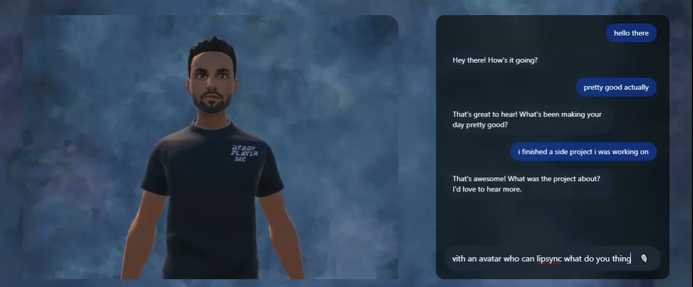

# Chatbot with Avatar and Lipsync

An AI-powered **chatbot with a 3D avatar** capable of real-time lipsync, combining cutting-edge AI models with interactive 3D animation.

---

## 🎥 Demo

▶ **[Watch the full demo video](Demo/demo.webm)**

---

## ✨ Key Features
- **Real-time Lipsync:** Avatar powered by Unity + SALSA Suite.
- **AI Chatbot:** Text & voice input supported.
- **Voice Pipeline:**
  - **Speech-to-Text:** Whisper Large v3
  - **LLM Chatbot:** Mistral Nemo (OpenRouter)
  - **Text-to-Speech:** `tts_models/en/vctk/vits`
- **Backend:** FastAPI running on Kaggle and exposed via **LocalTunnel**.
- **Frontend:** React page.
- **Audio Fetch System:** A **custom Unity C# script** automatically fetches the latest audio response from **backend**.

---

## 🧠 LangGraph Flow
This project uses **LangGraph** to manage the chatbot's conversational flow.

➡ [**View the Full LangGraph Flow Here**](Langgraph/langgraph_flow.png)
